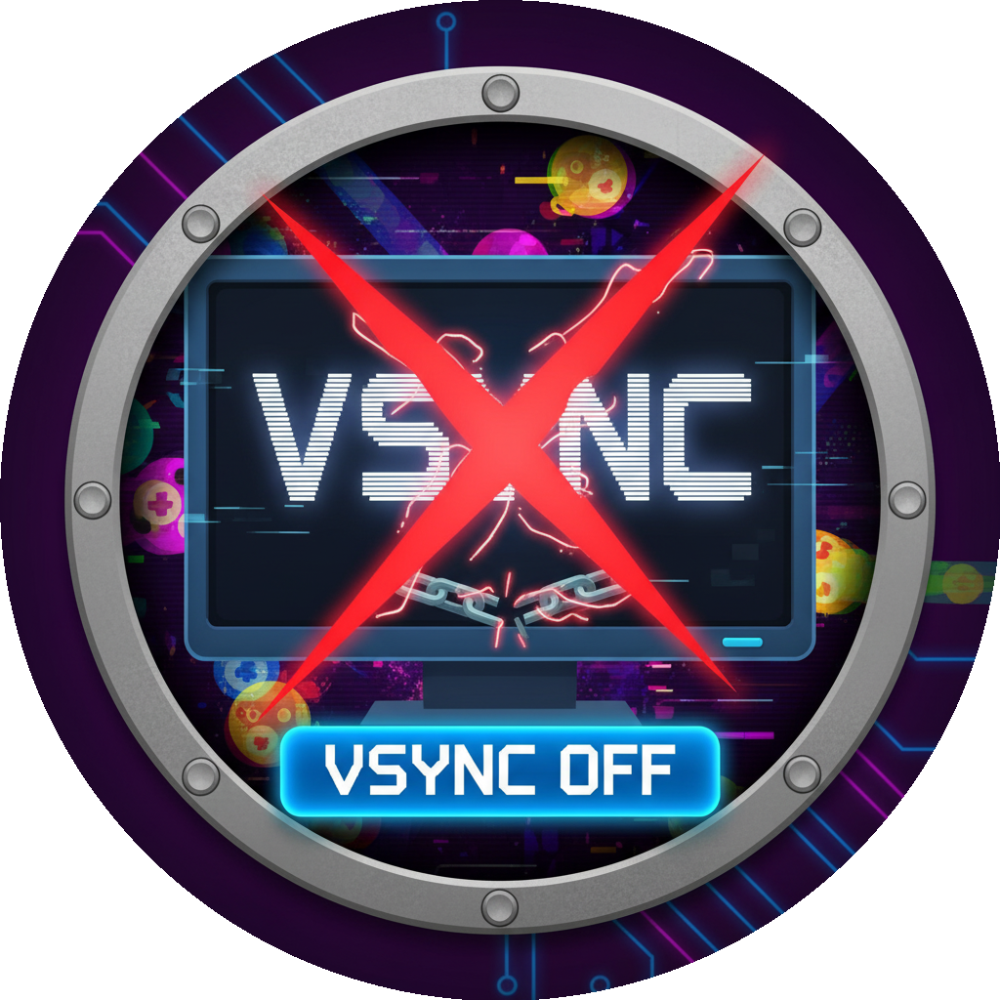

<h1 align="center">

</h1>
<h3 align="center">Removes vertical sync and sets target frame rate to 244 or the one you set in the menu FPS for smoother gameplay. Requires to restart the game.</h3>
<h1 align="center">Remove VSync</h1>

